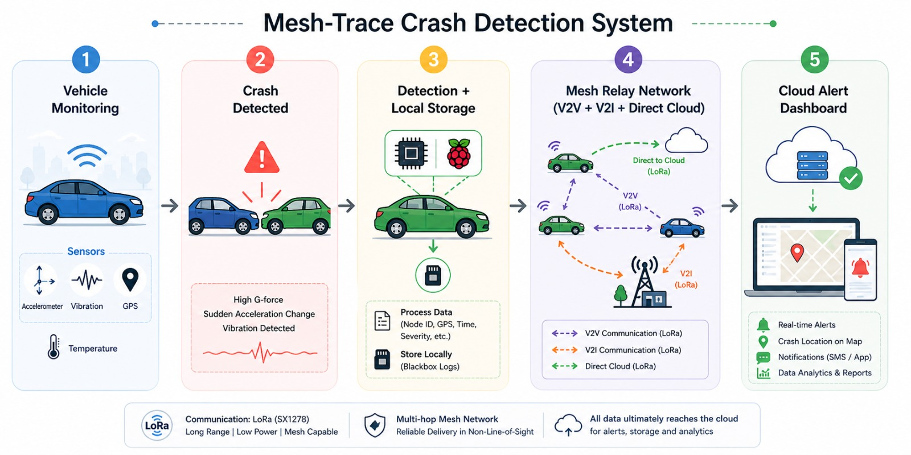

# MESHTRACE

**A low-cost IoT vehicle crash detection and emergency alert system with LoRa mesh fallback for low-connectivity zones.**

MESH-TRACE detects vehicle crashes in real time using multi-sensor fusion, classifies severity, and delivers alerts to a cloud backend within seconds — over WiFi when available, or over a cooperative LoRa V2V/V2I relay network when it isn't.



---

## Overview

Road accidents remain a leading cause of preventable death, and delayed emergency response is a major contributing factor — especially in rural and semi-urban areas with poor connectivity. MESH-TRACE is a low-cost alternative to proprietary systems like eCall or OnStar, built on off-the-shelf hardware and a serverless cloud backend.

**Highlights:**

- Multi-sensor fusion crash detection to minimize false positives
- Three-tier communication fallback: direct WiFi → roadside LoRa relay → nearby vehicle relay
- Serverless cloud backend for alert processing, storage, and notifications
- Local blackbox logging, independent of network availability
- GPS-tagged, severity-classified crash alerts

## How It Works (High Level)

1. **Monitoring** — An onboard unit continuously reads motion, vibration, GPS, and environmental sensors.
2. **Detection** — A dual-condition sensor fusion approach confirms a genuine crash (rather than a bump or false trigger) and classifies its severity.
3. **Local logging** — Every event is written to a persistent local log, so no data is lost even if connectivity is unavailable.
4. **Relay network** — If the vehicle has no direct connection, the alert is opportunistically relayed through nearby infrastructure or nearby vehicles until it reaches the cloud.
5. **Cloud & alerting** — The cloud backend processes the alert, stores a record, and notifies the relevant contacts with the crash location and severity.

## Repository Structure

```
node1_crash_unit/     # Vehicle-side detection unit
assets/                 # Diagrams and documentation images
```

## Authors

- **Avdhut Gogawale**
- **Vinaykumar Takankhar**
- **Soham Valunjkar**

## License

Copyright © 2026 Avdhut Gogawale, Vinaykumar Takankhar, Soham Valunjkar.
All rights reserved.

This source code is proprietary. Unauthorized copying, modification,
distribution, or use of this software, via any medium, is strictly
prohibited without prior written permission from the copyright holders.
